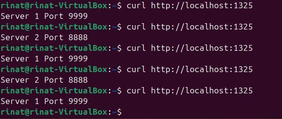
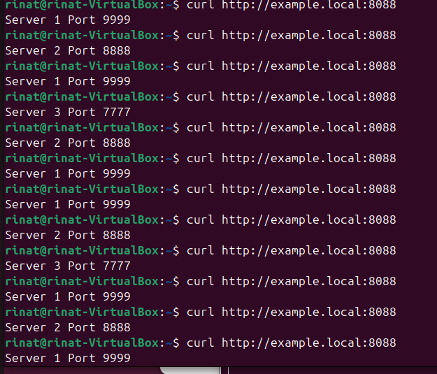
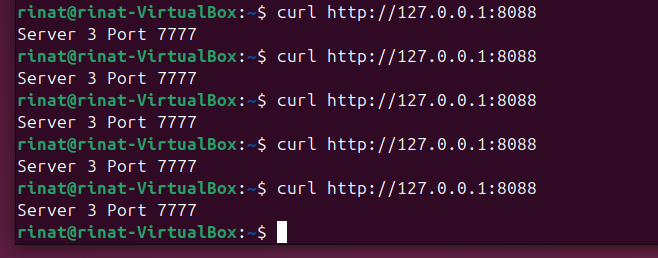

# Домашнее задание к занятию "`Кластеризация и балансировка нагрузки`" - `Серкебаев Ринат`

https://github.com/netology-code/sflt-homeworks/blob/main/2.md


### Задание 1 

haproxy.cfg

```
global
    log /dev/log local0
    log /dev/log local1 notice
    chroot /var/lib/haproxy
    stats socket /run/haproxy/admin.sock mode 660 level admin expose-fd listeners
    stats timeout 30s
    user haproxy
    group haproxy
    daemon

defaults
    log global
    mode tcp
    option tcplog
    timeout connect 5000
    timeout client 50000
    timeout server 50000

listen stats
    bind :888
    mode http
    stats enable
    stats uri /stats
    stats refresh 5s
    stats realm HAProxy\ Statistics

#Задание 1: TCP Round Robin
listen web_tcp
    bind :1325
    mode tcp
    balance roundrobin
    server s1 127.0.0.1:8888 check inter 3s
    server s2 127.0.0.1:9999 check inter 3s```

скриншот, где видно перенаправление запросов на разные серверы при обращении к HAProxy



---

### Задание 2 

haproxy.cfg

```
global
    log /dev/log local0
    log /dev/log local1 notice
    daemon
    maxconn 2048

defaults
    log     global
    mode    http
    option  httplog
    option  dontlognull
    timeout connect 5s
    timeout client  30s
    timeout server  30s

# frontend принимает http-трафик
frontend http_in
    bind *:8088

    # балансировать только если домен example.local
    acl is_example_local hdr_beg(host) -i example.local

    use_backend wrr_back if is_example_local
    default_backend default_plain

# Weighted Round Robin backend (L7)
backend wrr_back
    mode http
    balance roundrobin

    # серверы с весами
    server s1 127.0.0.1:7777 weight 2 check
    server s2 127.0.0.1:8888 weight 3 check
    server s3 127.0.0.1:9999 weight 4 check

# бэкенд по умолчанию – просто отдаёт что-то одно без балансировки
backend default_plain
    mode http
    balance roundrobin
    server fallback1 127.0.0.1:7777
```

скриншот где видно перенаправление запросов на разные серверы при обращении к HAProxy c использованием домена example.local


скриншот запроса напрямую без домена example.local


